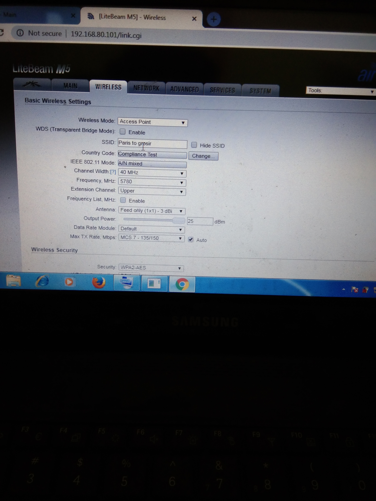
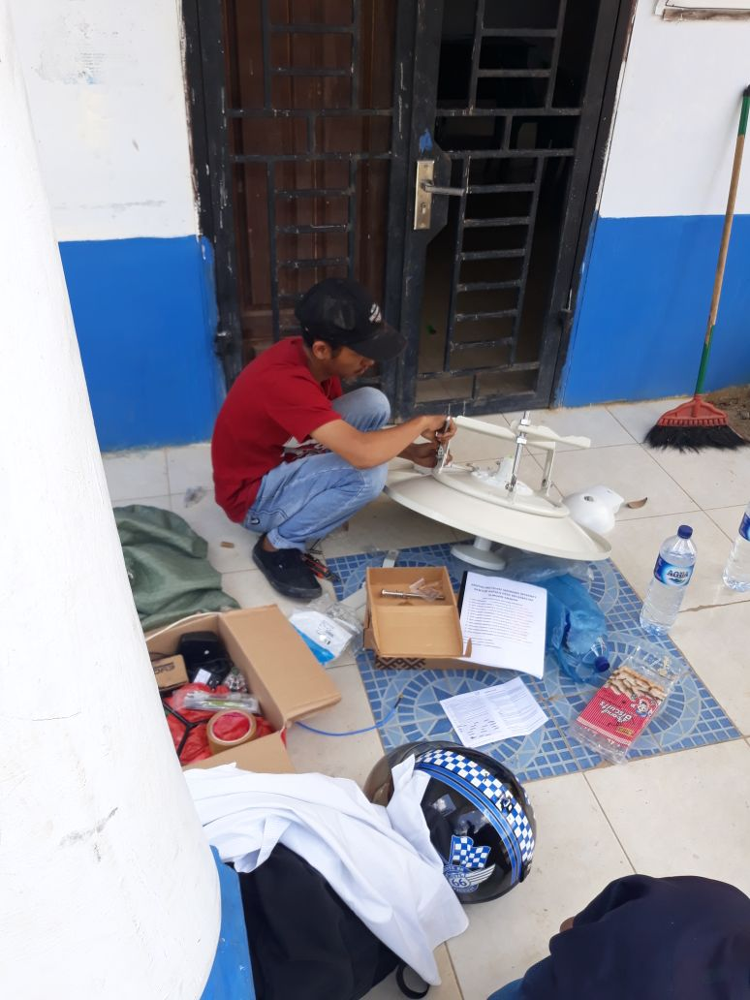
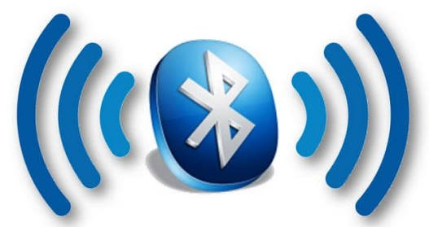
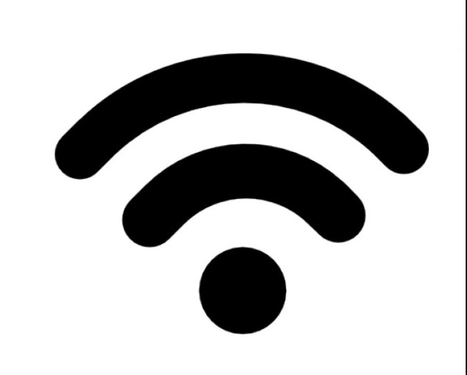
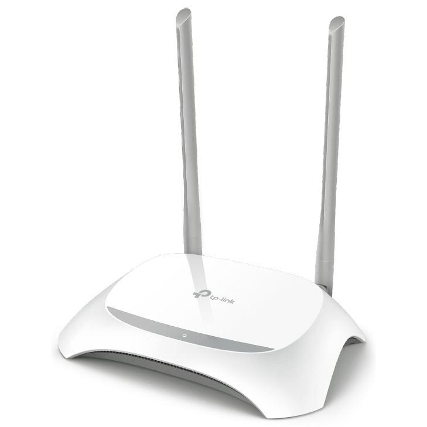
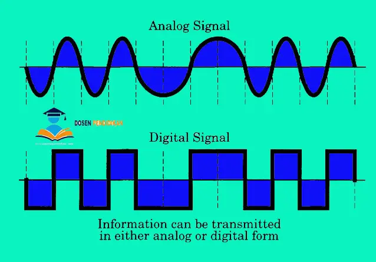

# M.KHAIRUL IKHSAN

# SINYAL RF (RADIO FREKUESI)
## MENGENAL SINYAL RF
### PENGERTIAN SINYAL RF
Sinyal RF merupakan gelombang elektromagnetik yang digunakan oleh sistem komunikasi untuk mengirim informasi melalui udara dari satu titik ke titik lain. Sinyal RF telah digunakan selama beberapa tahun. Sinyal tersebut memberikan cara untuk mengirimkan musik pada radio FM dan video pada televisi. Pada kenyataannya, sinyal RF juga merupakan sarana umum untuk mengirim data melalui jaringan wireless.

### JENIS-JENIS SINYAL RF
Sinyal RF memiliki beberapa jenis yaitu :
1. Sinyal radio TV 
2. Sinyal radio FM
3. Sinyal di jaringan wireless

Untuk di bagian radio saya akan terangkan sedikit bagaimana cara penggunaan nya dan contoh untuk setting frekuensi dan ketinggiannya. 
Untuk ketinggian sendiri sinyal radio harus memiliki ketinggian yang sama untuk radio ACCESPOINT dan radio STATION nya sendiri karena apabila ketinggian tidak pas maka akan sulit untk radio saling konek dan bisa sinyal yang di hasilkan tidak sesuai seperti yang kita harapkan. 
Maka dari itu contoh RADIO AP memiliki ketinggian 40meter maka RADIO STATION harus memiliki ketinggian yang serupa agar sinyal bisa dengan mudah tersambung. 

Oke kali ini sedikit akan saya paparkan/jelaskan pengalamn say sewaktu bekerja sebagai IT NETWORK PROVIDER 

Nah untuk di gambar ini saya menggunakan frequency 5780,dan untk channel saya pakai chnel 40Mhz di Acces point untk STATION sudah pasti saya samakan teman"bisa lihat sendiri di gambar ya. 
Untk frequency saya menggunakan radio dari UBNT memeiliki lumayan bnyk frequency dari 4000-6000an FREQUENCY.
Dan untuk chnnel sendiri ada dari. Channel 20Mhz sampai 40Mhz

Nah dari gambar di atas itu adalah radio dari UBNT yang sedang di rakit

# INFRARED

Infrared (infra nerah) ialah sinar elektromagnet yang panjang gelombangnya lebih daripada cahaya nampak yaitu di antara 700 nm dan 1 mm. Sinar infrared merupakan cahaya yang tidak tampak. Infrared menggunakan sinar untuk sinyal ,seperti tv remote untuk mengganti channel di televisi. Infrared tidak dapat tembus benda yang menghalanginya untuk menjangkau receiver atau butuh pantulan ,karena sifatnya cahaya . infrared juga berfungsi sebagai media untuk mengirim data. Contohnya pada handphone.

# Pengertian bluetooth, fungsi dan cara kerjanya 
 
Bluetooth adalah suatu peralatan media komunikasi yang dapat digunakan untuk menghubungkan sebuah perangkat komunikasi dengan perangkat komunikasi lainnya, bluetooth umumnya digunakan di handphone, komputer atau pc, tablet, dan lain-lain. Fungsi bluetooth yaitu untuk mempermudah berbagi atau sharing file, audio, menggantikan penggunaan kabel dan lain-lain. Saat ini sudah banyak sekali perangkat yang menggunakan bluetooth.

# DEFENISI Bluetooth
adalah sebuah teknologi komunikasi wireless atau tanpa kabel yang beroperasi dalam pita frekuensi 2,4 GHz (antara 2.402 GHz s/d 2.480 GHz) dengan menggunakan sebuah frequency hopping tranceiver yang mapu menyediakan layanan komunikasi data dan juga suara secara real-time antara host-host bluetooth dengan jarak jangkauan layanan yang terbatas.

# DEFENISI WIFI DAN PENGERTIANNYA
WIFI adalah singkatan dari “Wireless Fidelity” yaitu suatu teknologi komunikasi nirkabel yang memanfaatkan gelombang radio untuk menghubungkan dua perangkat atau lebih untuk dapat saling bertukar informasi. WIFI atau sering ditulis dengan “Wi-Fi” ini pertama kali ditemukan oleh perusahaan NCR Corporation dan AT&T pada tahun 1991 untuk sistem kasir. Namun Saat ini, teknologi WIFI ini telah banyak digunakan pada perangkat mobile seperti Smartphone dan Laptop hingga ke perangkat elektronik lainnya seperti Televisi, DVD Player, Digital Kamera, Printer, Konsol Game dan bahkan lebih luas lagi hingga ke perangkat rumah tangga lainnya seperti Lampu, Kulkas dan Pengatur Suhu (AC).

## Cara Kerja WiFi
WiFi adalah Jaringan Area Lokal atau LAN (Local Area Network) yang tidak memerlukan kabel dengan koneksi kecepatan yang tinggi. WiFi sering disebut juga dengan WLAN atau Wireless Local Area Network.  Sinyal Radio adalah kunci yang memungkinan komunikasi dalam jaringan WiFi. Teknologi WiFi ini menggunakan dua frekuensi gelombang radio dalam mengirimkan dan menerima sinyal Radio. Kedua Frekuensi gelombang radio tersebut adalah Frekuensi 2,4GHz dan 5GHz.

# PENGERTIAN SINGKAT ENCODING
Encoding adalah penyandian atau proses untuk mengubah sinyal asal, ke dalam bentuk yang lebih otpimal untuk keperluan komunikasi data dan penyimpanan data. 
Misalnya satu byte data terdiri dari 8 bit jajar. Untuk mengirimkan data bit jajar ini memerlukan 8 saluran kanal pengirim dan 8 saluran kanal penerima. Karena ini tidak efisien, maka informasi harus di encoding atau disandikan kedalam bentuk data deret sehingga kita bisa mengirim sinyal hanya dengan satu kanal pengirim dan satu kanal penerima. 
Decoding adalah mengekstrak data yang telah di encoding tadi ke dalam bentuk sinyal asli atau asalnya. 
Dalam hal ini sebagai contoh mengubah sinyal bit deret menjadi sinyal bit data jajar. 
Sama juga untuk menyimpan data kedalam harddisk, harus di encoding dalam bentuk data deret. Tanpa encoding, diperlukan 8 harddisk yang bekerja sinkron yang mana itu mustahil. 
Tapi kalau untuk video, biasanya encoding itu mengecilkan atau mencompresi file dan decoding itu mengekstrak kedalam bentuk file asalnya.

#SELAMAT MEMBACA :)
